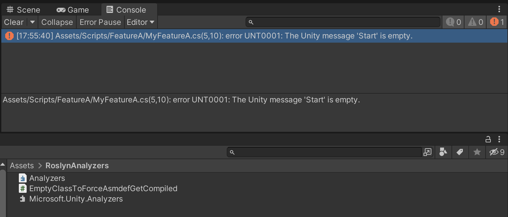
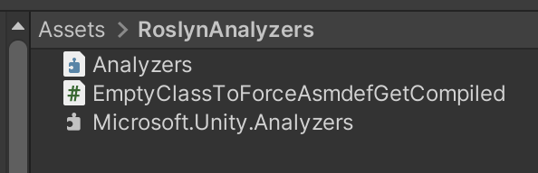
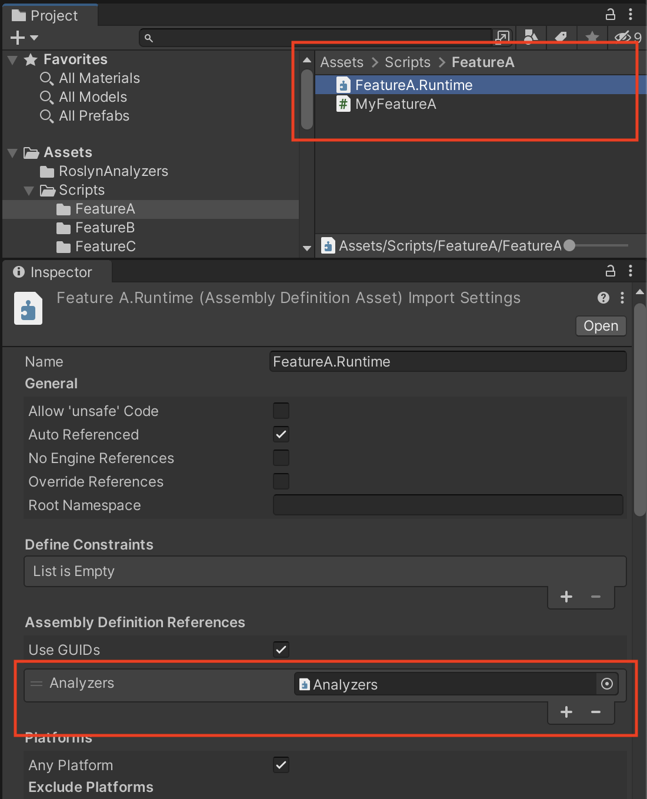
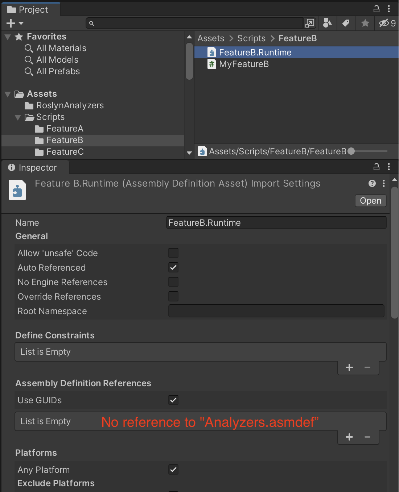
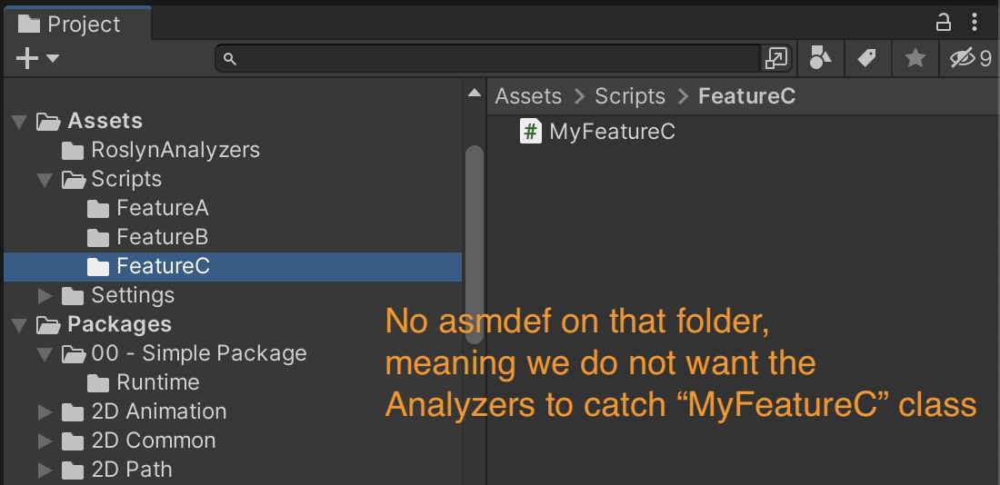
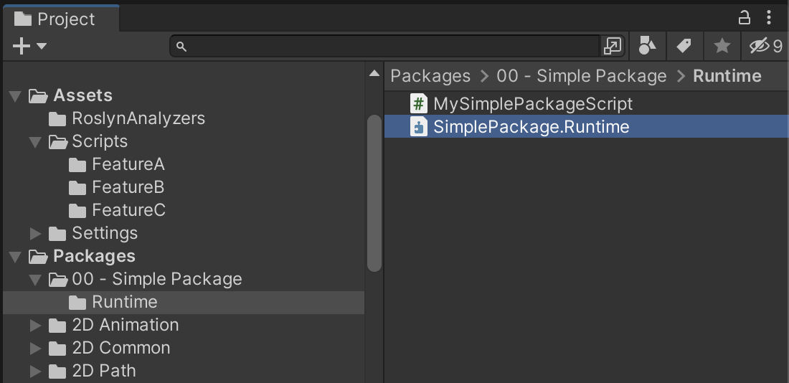

# unity-roslyn-analyzers
Repo created exclusively to realize tests regarding Roslyn Analyzers in the Unity Game Engine.

The `Microsoft.Unity.Analyzers.dll` used in that repo is a compiled version that threats the rule below as `error`:
- https://github.com/microsoft/Microsoft.Unity.Analyzers/blob/main/doc/UNT0001.md

Every script described below is a MonoBehaviour with an empty Start method, which should show errors in the Unity Console.

Since our intention in that example is to only run the Analyzers for the `FeatureA`, Unity will should the error only for the `MyFeatureA.cs` script as you can see in the image below:

# Files settings:

- `Assets/RoslynAnalyzers/Microsoft.Unity.Analyzers.dll` has a `Analyzers.asmdef` close to it.

---
- `Assets/Scripts/FeatureA/MyFeatureA.cs` has a `FeatureA.asmdef` close to it (which has a reference to `Analyzers.asmdef`).

---
- `Assets/Scripts/FeatureB/MyFeatureB.cs` has a `FeatureB.asmdef` close to it (but without reference to `Analyzers.asmdef`)

---
- `Assets/Scripts/FeatureC/MyFeatureC.cs` has not asmdef (meaning it is part of the `Assembly-CSharp.dll`)

---
- `Packages/00 - Simple Package/MySimplePackageScript.cs` has an asmdef for testing purposes.

---

